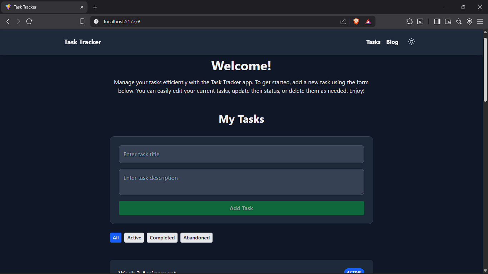
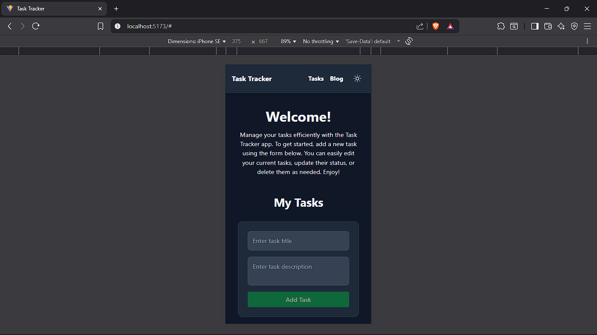

# MERN Stack Task Manager

This is a full-stack task management application built with the MERN (MongoDB, Express, React, Node.js) stack. It allows users to perform CRUD operations on tasks, manage task statuses, and view, search, and paginate posts from a public API.

## Features

- **Task Management**: Create, read, update, and delete tasks.
- **Task Statuses**: Manage tasks with statuses: 'active', 'completed', and 'abandoned'.
- **Filtering**: Filter tasks by their status.
- **API Integration**: Fetches and displays blog posts from the public [JSONPlaceholder](https://jsonplaceholder.typicode.com/) API.
- **Search & Pagination**: Search through fetched posts and navigate through pages.
- **Responsive Design**: A clean and responsive UI built with React and Tailwind CSS.
- **Smooth Scrolling**: Custom smooth scroll animations for a polished user experience during on-page navigation and pagination.

## Screenshots

*(Add screenshots of your application here. For example: Task list view, Add task form, API posts view, etc.)*




## Project Schema

The application uses a single Mongoose model for tasks.

### Task Schema

| Field         | Type    | Required | Default  | Description                                  |
|---------------|---------|----------|----------|----------------------------------------------|
| `title`       | String  | Yes      |          | The main title of the task.                  |
| `description` | String  | No       |          | A detailed description of the task.          |
| `status`      | String  | Yes      | `active` | The current status of the task. (Enum: `active`, `completed`, `abandoned`) |
| `createdAt`   | Date    | Yes      | `Date.now` | Timestamp for when the task was created.     |
| `updatedAt`   | Date    | Yes      | `Date.now` | Timestamp for when the task was last updated.|

## Folder Structure

The project is organized into a clean and scalable structure, separating frontend and backend concerns.

```
Project-folder/
├── config/                 # Database configuration
│   └── db.js               # MongoDB connection setup
├── models/                 # Mongoose schemas and models
│   └── Task.js             # Task schema definition
├── public/                 # Static assets
├── routes/                 # Backend Express routes
│   └── TaskRoutes.js       # Task-related CRUD, filtering, pagination, stats
├── src/                    # Frontend source code (React)
│   ├── api/                # API integration functions
│   ├── components/         # Reusable UI components
│   ├── context/            # React context providers
│   ├── hooks/              # Custom React hooks
│   ├── pages/              # Page components
│   └── utils/              # Utility functions
│   ├── App.jsx             # Main application component
│   ├── index.css           # Global styles and Tailwind directives
│   └── main.jsx            # Application entry point 
├── .env.example            # Example environment variables
├── .gitignore              # Git ignore file
├── eslint.config.js        # ESLint configuration
├── index.html              # Main HTML file for Vite
├── jsconfig.json           # JS path alias configuration
├── package.json            # Project dependencies and scripts
├── README.md               # Project documentation
├── server.js               # Backend server entry point
├── tailwind.config.js      # Tailwind CSS configuration
└── vite.config.js          # Vite configuration
```

---

## Tech Stack

- **Frontend**:
  - [React](https://reactjs.org/)
  - [Vite](https://vitejs.dev/)
  - [Tailwind CSS](https://tailwindcss.com/)
  - [React Router](https://reactrouter.com/) for client-side routing.

- **Backend**:
  - [Node.js](https://nodejs.org/)
  - [Express](https://expressjs.com/)
  - [Mongoose](https://mongoosejs.com/)

- **Database**:
  - [MongoDB](https://www.mongodb.com/) (via MongoDB Atlas)

---

## Prerequisites

Before you begin, ensure you have the following installed on your local machine:

- [Node.js](https://nodejs.org/en/download/) (v18.x or later recommended)
- [npm](https://www.npmjs.com/get-npm) (comes with Node.js) or [Yarn](https://yarnpkg.com/)
- A [MongoDB Atlas](https://www.mongodb.com/cloud/atlas/register) account to get a database connection string.

---

## Setup and Installation

This guide assumes you are cloning the existing repository. If you were starting from scratch, you would begin by creating a new Vite project with `npm create vite@latest my-project -- --template react`.

### 1. Clone the Repository

First, clone the project repository to your local machine.

```bash
git clone <repository-url>
cd <project-folder>
```

### 2. Install Dependencies

This project uses several packages for its frontend and backend functionality. You can install all of them at once by running:

```bash
npm install
```
Below is a breakdown of the key dependencies and their roles in the project:

#### Backend Dependencies

- **Express (express)**: A minimal and flexible Node.js web application framework that provides a robust set of features for web and mobile applications. It's the backbone of our backend server.
- **Mongoose (mongoose)**: An Object Data Modeling (ODM) library for MongoDB and Node.js. It helps us define a schema for our data and easily interact with the MongoDB database.
- **Dotenv (dotenv)**: A zero-dependency module that loads environment variables from a .env file into process.env. This is how we securely manage our MONGO_URI without hardcoding it.
- **CORS (cors)**: A Node.js package for providing an Express middleware that enables Cross-Origin Resource Sharing. It's essential for allowing our frontend (on localhost:5173) to make API requests to our backend (on localhost:3000).
-   **Node Type Definitions** (`@types/node`): A development dependency that provides type definitions for Node.js, improving editor autocompletion in files like `vite.config.js`.

#### Frontend & Styling Dependencies

-   **React** (`react`, `react-dom`): A JavaScript library for building user interfaces.
-   **React Router** (`react-router-dom`): Handles client-side routing, enabling navigation between different views without a full page reload.
-   **React Router Hash Link** (`react-router-hash-link`): An extension for React Router that provides smooth scrolling to on-page anchors (like `#tasks`).
-   **Tailwind CSS** (`tailwindcss`): A utility-first CSS framework for rapidly building custom user interfaces.
-   **Tailwind CSS Vite Plugin** (`@tailwindcss/vite`): A Vite plugin that seamlessly integrates Tailwind CSS into the Vite build process.
-   **Prop-Types** (`prop-types`): Provides runtime type checking for React props, which helps catch bugs.

### 3. Set Up Environment Variables

This project requires environment variables for the database connection and API URL.

1.  Create a new file named `.env` in the root of the `week-3-project` directory.
2.  Copy the contents of `.env.example` and replace values as instructed.
3.  Save the file.


**How to get your `MONGO_URI`:**
- Log in to your MongoDB Atlas account.
- Create a new project and a new cluster.
- In your cluster, click "Connect" -> "Drivers".
- Select Node.js as your driver and copy the connection string provided.
- **Important**: Replace `<password>` with your database user's password and `<database>` with your database name (e.g., `task-manager`).

---

## Running the Application

You will need to run two separate processes in two different terminals: one for the backend server and one for the frontend development server.

### 1. Start the Backend Server

Open a new terminal in your project folder and run the following command to start the Node.js/Express server. It will connect to your MongoDB database and listen for API requests.

```bash
node server.js
```

You should see `Server is running on port 3000` and `Successfully connected to MongoDB!` in your console.

### 2. Start the Frontend Server

In a **new terminal window** inside your project folder, run the following command to start the Vite development server.

```bash
npm run dev
```

The development server will start on http://localhost:\
<port>, where <port> is typically 5173 unless otherwise configured in your Vite settings.

## Troubleshooting

If you encounter errors such as:
`TypeError: Failed to fetch` or `net::ERR_CONNECTION_REFUSED`

It usually means your frontend is trying to reach the backend when it’s not running or on the wrong port.
Make sure to:
- Start your backend with `node server.js` (which runs on port 3000 by default).
- Confirm your `VITE_API_URL` in the `.env` file is set to `http://localhost:3000/api`.
- Check that your `MONGO_URI` connection string is valid and that your IP address is whitelisted in MongoDB Atlas.
